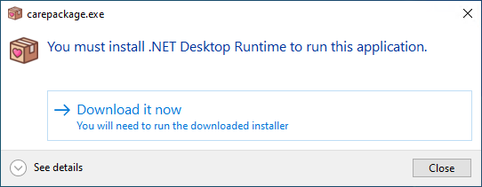

_CarePackage_ is a desktop application for Windows 10/11 heavily inspired by [Ninite](https://ninite.com/) that makes it quick and easy to download and install all of your favorite programs at once. CarePackage's intended use case is to be used on a new installation of Windows, but of course you can use it however you'd like!

CarePackage is built with Windows Forms on .NET 9.0.

What CarePackage **DOES**:
- Downloads the __latest__ versions of the programs you select
- Installs each program, one after another, or presents the files if the downloaded programs are compressed archives
- Allows you to opt out of installing the programs after they've been downloaded

What CarePackage **DOESN'T DO**
- Check for program updates
- Update installed programs
  - Most programs allow you to update installations by running a new installer

### Installing CarePackage

CarePackage is a single executable and doesn't require any installation. You can download the latest `carepackage.exe` [here.](https://github.com/depthbomb/CarePackage/releases/latest)

Unfortunately CarePackage requires the [.NET 9.0 Desktop Runtime](https://dotnet.microsoft.com/en-us/download/dotnet/9.0) despite being published as self-contained because using WinRT APIs causes the published application to not actually include the runtime files. However, you will be prompted to download and install the runtime on launch so there is minimal effort required.

