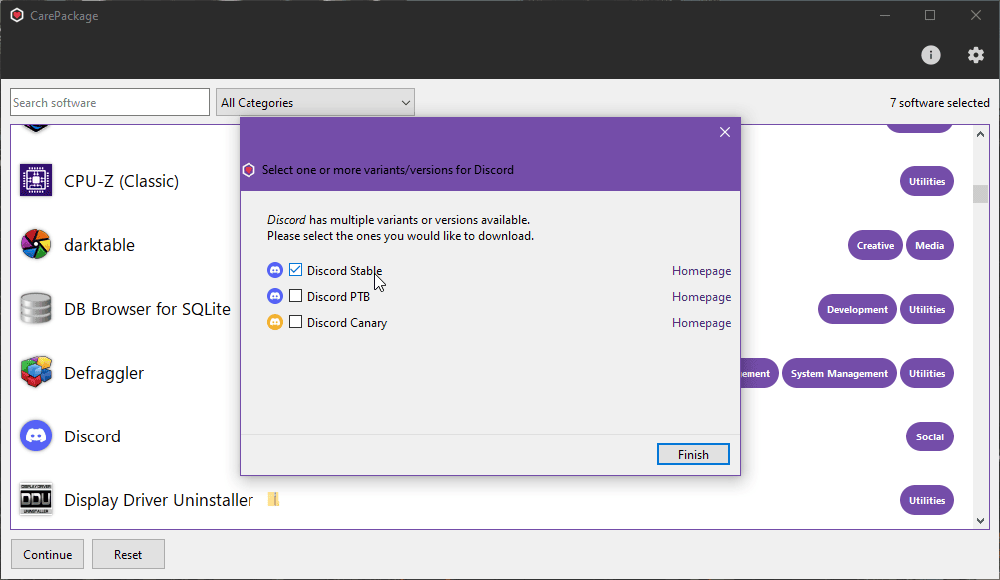

_CarePackage_ is a desktop application for Windows 10/11 heavily inspired by [Ninite](https://ninite.com/) that makes it quick and easy to download and install all of your favorite programs at once. CarePackage's intended use case is to be used on a new installation of Windows, but of course you can use it however you'd like!

You can view all software that is managed by CarePackage in [SOFTWARE.md](SOFTWARE.md).

What CarePackage **DOES**:
- Downloads the __latest__ versions of the programs you select
- Installs each program, one after another, or presents the files if the downloaded programs are compressed archives
- Allows you to opt out of installing the programs after they've been downloaded

What CarePackage **DOESN'T DO**
- Check for program updates
- Update installed programs
  - Most programs allow you to update installations by running a new installer

### Installing CarePackage

The latest version of CarePackage can be downloaded from the [releases](https://github.com/depthbomb/CarePackage/releases/latest).

Alternatively, you can use this URL: `https://bit.ly/get-carepackage`

### Planned Features

- Selecting different "versions" of software to manage, for example instead of having two listings of _Godot_ for the normal version and the C# version, it will be a single listing that lets you choose which version to manage
- The ability to text search software

### Screenshots

