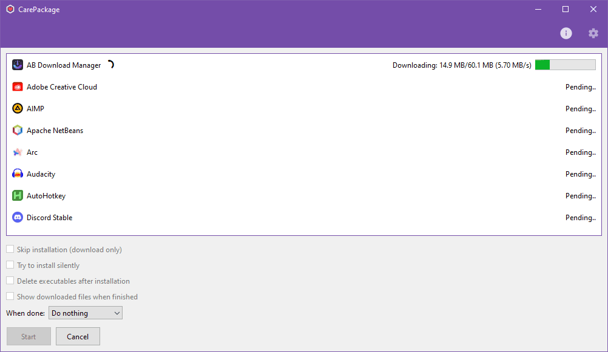

_CarePackage_ is a desktop application for Windows 10/11 heavily inspired by [Ninite](https://ninite.com/) that makes it quick and easy to download and install all of your favorite software at once. CarePackage's intended use case is to be used on a new installation of Windows, but of course you can use it however you'd like!

You can view all software managed by CarePackage in [SOFTWARE.md](SOFTWARE.md).

What CarePackage **DOES**:
- Downloads the __latest__ versions of the software you select
- Installs each software, one after another, or presents the files if they are compressed archives
- Allows you to opt out of installing the software after they've been downloaded
- Allows you to download a specific version or variant of software

What CarePackage **DOESN'T DO**
- Check for software updates
- Update installed software
  - Most software allows you to update installations by running a new installer

### Installing CarePackage

The latest version of CarePackage can be downloaded from the [releases](https://github.com/depthbomb/CarePackage/releases/latest).

**NEW:** CarePackage can also be installed via [WinGet](https://learn.microsoft.com/en-us/windows/package-manager/winget/): `winget install carepackage`

### Screenshots

### Development

- Create a venv and run `pip install -r requirements.txt`
- `invoke build` can be used to compile the application and `invoke deploy` will compile the application as well as create its installer
- Use `invoke generate-software-table` to generate SOFTWARE.md, this should be done after adding, removing, and/or modifying software definitions
