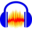
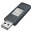

# All Software

## Audio & Sound

|  | Name | Is Archive? | Requires Admin? | Additional Categories | # of Variants/Versions |
| :-: | --- | :-: | :-: | :-: | :-: |
|  | [AIMP](https://aimp.ru) | ❌ | ❌ | Media | `0`
|  | [Audacity](https://audacityteam.org) | ❌ | ❌ | Media | `0`
|  | [Equalizer APO](https://sourceforge.net/projects/equalizerapo) | ❌ | ✔ | Utilities | `0`
|  | [foobar2000](https://foobar2000.org) | ❌ | ❌ | Media | `0`
|  | [iTunes](https://apple.com/itunes) | ❌ | ❌ | Media | `0`
|  | [Plex](https://plex.tv) | ❌ | ❌ | Media | `3`
|  | [Spotify](https://spotify.com) | ❌ | ❌ | Media | `0`
|  | [VLC Media Player](https://videolan.org) | ❌ | ✔ | Media | `0`

---

## Web Browsers

|  | Name | Is Archive? | Requires Admin? | Additional Categories | # of Variants/Versions |
| :-: | --- | :-: | :-: | :-: | :-: |
|  | [Arc](https://arc.net) | ❌ | ❌ | None | `0`
|  | [Brave](https://brave.net) | ❌ | ❌ | None | `0`
|  | [Google Chrome](https://google.com/chrome) | ❌ | ❌ | None | `0`
|  | [LibreWolf](https://librewolf.net) | ❌ | ✔ | None | `0`
|  | [Microsoft Edge](https://microsoft.com/en-us/edge) | ❌ | ❌ | None | `0`
|  | [Mozilla Firefox](https://mozilla.org/firefox) | ❌ | ❌ | None | `0`
|  | [Opera](https://opera.com) | ❌ | ❌ | None | `0`
|  | [Opera GX](https://opera.com/gx) | ❌ | ❌ | None | `0`
|  | [Vivaldi](https://vivaldi.com) | ❌ | ❌ | None | `0`
|  | [Waterfox](https://waterfox.net) | ❌ | ❌ | None | `0`

---

## Creative

|  | Name | Is Archive? | Requires Admin? | Additional Categories | # of Variants/Versions |
| :-: | --- | :-: | :-: | :-: | :-: |
|  | [Adobe Creative Cloud](https://www.adobe.com/creativecloud.html) | ❌ | ❌ | None | `0`
|  | [Blender](https://blender.org) | ❌ | ❌ | 3D Modelling | `0`
|  | [darktable](https://darktable.org) | ❌ | ✔ | Media | `0`
|  | [GIMP](https://gimp.org) | ❌ | ❌ | None | `0`
|  | [Godot](https://godotengine.org) | ❌ | ❌ | Video Game Development | `2`
|  | [Inkscape](https://inkscape.org) | ❌ | ✔ | None | `0`
|  | [Krita](https://krita.org) | ❌ | ❌ | None | `0`
|  | [Paint.NET](https://getpaint.net) | ✔ | ❌ | None | `0`
|  | [Unity Hub](https://unity.com) | ❌ | ✔ | Video Game Development | `0`

---

## Development

|  | Name | Is Archive? | Requires Admin? | Additional Categories | # of Variants/Versions |
| :-: | --- | :-: | :-: | :-: | :-: |
|  | [Apache NetBeans](https://netbeans.apache.org) | ❌ | ✔ | None | `0`
|  | [CMake](https://cmake.org) | ❌ | ❌ | None | `0`
|  | [DB Browser for SQLite](https://sqlitebrowser.org) | ❌ | ❌ | Utilities | `0`
| ") | [dnSpy (Fork)](https://github.com/dnSpyEx/dnSpy) | ✔ | ❌ | Utilities | `0`
|  | [Docker Desktop](https://docker.com/products/docker-desktop) | ❌ | ❌ | None | `0`
|  | [.NET](https://dot.net) | ❌ | ❌ | Runtimes | `8`
|  | [Eclipse IDE](https://eclipseide.org) | ❌ | ❌ | None | `0`
|  | [FileZilla](https://filezilla-project.org) | ❌ | ❌ | File Management, Network Tools | `0`
|  | [Flutter SDK](https://docs.flutter.dev) | ✔ | ❌ | None | `0`
|  | [Git for Windows](https://git-scm.com) | ❌ | ❌ | File Management | `0`
|  | [GitHub CLI](https://cli.github.com) | ❌ | ❌ | None | `0`
|  | [GitHub Desktop](https://desktop.github.com) | ❌ | ❌ | None | `0`
|  | [Go](https://go.dev) | ❌ | ❌ | None | `0`
|  | [Hoppscotch](https://hoppscotch.io) | ❌ | ❌ | Network Tools | `0`
|  | [Inno Setup](https://jrsoftware.org/isinfo.php) | ❌ | ❌ | None | `0`
|  | [Insomnia](https://insomnia.rest) | ❌ | ❌ | Network Tools | `0`
|  | [InstallForge](https://installforge.net) | ❌ | ✔ | None | `0`
|  | [Java SE Development Kit](https://oracle.com/java/technologies/downloads) | ❌ | ❌ | Runtimes | `2`
|  | [JetBrains Toolbox](https://jetbrains.com/toolbox-app) | ❌ | ❌ | None | `0`
|  | [Lazarus](https://lazarus-ide.org) | ❌ | ❌ | None | `0`
|  | [MinGW](https://sourceforge.net/projects/mingw) | ❌ | ❌ | None | `0`
|  | [MSYS2](https://msys2.org) | ❌ | ❌ | None | `0`
|  | [Node.js](https://nodejs.org) | ❌ | ❌ | Runtimes | `2`
|  | [Notepad++](https://notepad-plus-plus.org) | ❌ | ✔ | None | `0`
|  | [NSIS](https://nsis.sourceforge.io/Download) | ❌ | ✔ | None | `0`
|  | [Postman](https://postman.com) | ❌ | ❌ | Network Tools | `0`
|  | [PowerShell 7](https://github.com/PowerShell/PowerShell) | ❌ | ❌ | Utilities | `0`
|  | [Python](https://python.org) | ❌ | ❌ | None | `2`
|  | [Qt](https://qt.io/download-open-source) | ❌ | ❌ | None | `0`
|  | [Rustup](https://rust-lang.org/learn/get-started) | ❌ | ❌ | None | `0`
|  | [Sublime Text](https://sublimetext.com) | ❌ | ❌ | None | `0`
|  | [Visual Studio Code](https://code.visualstudio.com) | ❌ | ❌ | None | `0`
|  | [Visual Studio 2022 Community](https://visualstudio.microsoft.com) | ❌ | ❌ | None | `0`
|  | [Windows App SDK](https://learn.microsoft.com/en-us/windows/apps/windows-app-sdk) | ❌ | ❌ | Runtimes | `0`

---

## Emulation

|  | Name | Is Archive? | Requires Admin? | Additional Categories | # of Variants/Versions |
| :-: | --- | :-: | :-: | :-: | :-: |
|  | [Azahar](https://azahar-emu.org) | ❌ | ❌ | Gaming | `0`
|  | [Cemu](https://cemu.info) | ✔ | ❌ | Gaming | `0`
|  | [Dolphin Emulator](https://dolphin-emu.org) | ✔ | ❌ | Gaming | `0`
|  | [DuckStation](https://duckstation.org) | ✔ | ❌ | Gaming | `0`
|  | [melonDS](https://melonds.kuribo64.net) | ✔ | ❌ | Gaming | `0`
|  | [PCSX2](https://pcsx2.net) | ✔ | ❌ | Gaming | `0`
|  | [PPSSPP](https://ppsspp.org) | ❌ | ❌ | Gaming | `0`
|  | [RPCS3](https://rpcs3.net) | ✔ | ❌ | Gaming | `0`
|  | [shadPS4](https://shadps4.net) | ✔ | ❌ | Gaming | `0`
|  | [Vita3K](https://vita3k.org) | ✔ | ❌ | Gaming | `0`

---

## File Management

|  | Name | Is Archive? | Requires Admin? | Additional Categories | # of Variants/Versions |
| :-: | --- | :-: | :-: | :-: | :-: |
|  | [CCleaner](https://ccleaner.com) | ❌ | ✔ | System Management, Utilities | `0`
|  | [Defraggler](https://ccleaner.com/defraggler) | ❌ | ✔ | System Management, Utilities | `0`
|  | [Dropbox](https://dropbox.com) | ❌ | ❌ | Utilities | `0`
|  | [FileZilla](https://filezilla-project.org) | ❌ | ❌ | Development, Network Tools | `0`
|  | [Git for Windows](https://git-scm.com) | ❌ | ❌ | Development | `0`
|  | [Google Drive](https://workspace.google.com/products/drive) | ❌ | ✔ | Utilities | `0`
|  | [Jackett](https://github.com/Jackett/Jackett) | ❌ | ❌ | Utilities | `0`
|  | [MEGAsync](https://mega.io/desktop) | ❌ | ❌ | Utilities | `0`
|  | [Microsoft OneDrive](https://microsoft.com/en-us/microsoft-365/onedrive) | ❌ | ❌ | Utilities | `0`
|  | [Motrix](https://motrix.app) | ❌ | ❌ | Utilities | `0`
|  | [PeaZip](https://peazip.github.io) | ❌ | ❌ | Utilities | `0`
|  | [qBittorrent](https://qbittorrent.org) | ❌ | ❌ | Network Tools, Utilities | `0`
|  | [Rufus](https://rufus.ie) | ❌ | ✔ | Utilities | `0`
|  | [7-Zip](https://7-zip.org) | ❌ | ❌ | Utilities | `0`
|  | [TeraCopy](https://codesector.com/teracopy) | ❌ | ❌ | Utilities | `0`
|  | [WinDirStat](https://windirstat.net) | ❌ | ❌ | System Management, Utilities | `0`
|  | [WinRAR](https://win-rar.com) | ❌ | ❌ | Utilities | `0`

---

## Video Game Development

|  | Name | Is Archive? | Requires Admin? | Additional Categories | # of Variants/Versions |
| :-: | --- | :-: | :-: | :-: | :-: |
|  | [Godot](https://godotengine.org) | ❌ | ❌ | Creative | `2`
|  | [Unity Hub](https://unity.com) | ❌ | ✔ | Creative | `0`

---

## Gaming

|  | Name | Is Archive? | Requires Admin? | Additional Categories | # of Variants/Versions |
| :-: | --- | :-: | :-: | :-: | :-: |
|  | [Azahar](https://azahar-emu.org) | ❌ | ❌ | Emulation | `0`
|  | [Battle.net](https://battle.net) | ❌ | ❌ | None | `0`
|  | [Cemu](https://cemu.info) | ✔ | ❌ | Emulation | `0`
|  | [Cheat Engine](https://cheatengine.org) | ❌ | ❌ | Utilities | `0`
|  | [Dolphin Emulator](https://dolphin-emu.org) | ✔ | ❌ | Emulation | `0`
|  | [DuckStation](https://duckstation.org) | ✔ | ❌ | Emulation | `0`
|  | [EA App](https://ea.com/ea-app) | ❌ | ❌ | None | `0`
|  | [Epic Games Launcher](https://store.epicgames.com) | ❌ | ❌ | None | `0`
|  | [GOG Galaxy](https://gog.com/galaxy) | ❌ | ❌ | None | `0`
|  | [Heroic Games Launcher](https://heroicgameslauncher.com) | ❌ | ❌ | None | `0`
|  | [itch](https://itch.io/app) | ❌ | ❌ | None | `0`
|  | [Medal](https://medal.tv) | ❌ | ❌ | Social | `0`
|  | [melonDS](https://melonds.kuribo64.net) | ✔ | ❌ | Emulation | `0`
|  | [Minecraft Launcher](https://minecraft.net) | ❌ | ❌ | None | `2`
|  | [Overwolf](https://overwolf.com) | ✔ | ❌ | None | `0`
|  | [Parsec](https://parsec.app) | ❌ | ✔ | None | `0`
|  | [PCSX2](https://pcsx2.net) | ✔ | ❌ | Emulation | `0`
|  | [Playnite](https://playnite.link) | ❌ | ❌ | None | `0`
|  | [PlayStation Accessories](https://controller.dl.playstation.net/controller/lang/en/2100004.html) | ❌ | ✔ | Peripherals | `0`
|  | [PPSSPP](https://ppsspp.org) | ❌ | ❌ | Emulation | `0`
|  | [Razer Cortex](https://razer.com/cortex) | ❌ | ✔ | None | `0`
|  | [RPCS3](https://rpcs3.net) | ✔ | ❌ | Emulation | `0`
|  | [shadPS4](https://shadps4.net) | ✔ | ❌ | Emulation | `0`
|  | [Steam](https://store.steampowered.com) | ❌ | ✔ | Social | `0`
|  | [Ubisoft Connect](https://ubisoft.com/en-us/ubisoft-connect) | ❌ | ✔ | None | `0`
|  | [Vita3K](https://vita3k.org) | ✔ | ❌ | Emulation | `0`

---

## Media

|  | Name | Is Archive? | Requires Admin? | Additional Categories | # of Variants/Versions |
| :-: | --- | :-: | :-: | :-: | :-: |
|  | [AIMP](https://aimp.ru) | ❌ | ❌ | Audio & Sound | `0`
|  | [Audacity](https://audacityteam.org) | ❌ | ❌ | Audio & Sound | `0`
|  | [darktable](https://darktable.org) | ❌ | ✔ | Creative | `0`
|  | [foobar2000](https://foobar2000.org) | ❌ | ❌ | Audio & Sound | `0`
|  | [HandBrake](https://handbrake.fr) | ❌ | ✔ | Utilities | `0`
|  | [iTunes](https://apple.com/itunes) | ❌ | ❌ | Audio & Sound | `0`
|  | [Lightshot](https://app.prntscr.com) | ❌ | ❌ | Utilities | `0`
|  | [OBS Studio](https://obsproject.com) | ❌ | ✔ | None | `0`
|  | [Plex](https://plex.tv) | ❌ | ❌ | Audio & Sound | `3`
|  | [ShareX](https://getsharex.com) | ❌ | ❌ | Utilities | `0`
|  | [Spotify](https://spotify.com) | ❌ | ❌ | Audio & Sound | `0`
|  | [Streamlabs Desktop](https://streamlabs.com/streamlabs-live-streaming-software) | ❌ | ✔ | None | `0`
|  | [Streamlink](https://streamlink.github.io) | ❌ | ✔ | None | `0`
|  | [VLC Media Player](https://videolan.org) | ❌ | ✔ | Audio & Sound | `0`

---

## 3D Modelling

|  | Name | Is Archive? | Requires Admin? | Additional Categories | # of Variants/Versions |
| :-: | --- | :-: | :-: | :-: | :-: |
|  | [Blender](https://blender.org) | ❌ | ❌ | Creative | `0`

---

## Network Tools

|  | Name | Is Archive? | Requires Admin? | Additional Categories | # of Variants/Versions |
| :-: | --- | :-: | :-: | :-: | :-: |
|  | [FileZilla](https://filezilla-project.org) | ❌ | ❌ | Development, File Management | `0`
|  | [GlassWire](https://glasswire.com) | ❌ | ✔ | Utilities | `0`
|  | [Hoppscotch](https://hoppscotch.io) | ❌ | ❌ | Development | `0`
|  | [Insomnia](https://insomnia.rest) | ❌ | ❌ | Development | `0`
|  | [Postman](https://postman.com) | ❌ | ❌ | Development | `0`
|  | [PuTTY](https://putty.org) | ❌ | ❌ | None | `0`
|  | [qBittorrent](https://qbittorrent.org) | ❌ | ❌ | File Management, Utilities | `0`
|  | [WinSCP](https://winscp.net) | ❌ | ❌ | Utilities | `0`
|  | [Wireshark](https://wireshark.org) | ❌ | ✔ | Utilities | `0`

---

## Peripherals

|  | Name | Is Archive? | Requires Admin? | Additional Categories | # of Variants/Versions |
| :-: | --- | :-: | :-: | :-: | :-: |
|  | [Corsair iCUE](https://corsair.com/us/en/s/icue) | ❌ | ✔ | None | `0`
|  | [Elgato Stream Deck](https://help.elgato.com/hc/en-us/sections/5162671529357-Elgato-Stream-Deck-Software-Release-Notes) | ❌ | ❌ | None | `0`
|  | [Logitech G HUB](https://logitechg.com/en-us/innovation/g-hub.html) | ❌ | ✔ | None | `0`
|  | [NVIDIA App](https://nvidia.com/en-us/software/nvidia-app) | ❌ | ✔ | None | `0`
|  | [PlayStation Accessories](https://controller.dl.playstation.net/controller/lang/en/2100004.html) | ❌ | ✔ | Gaming | `0`

---

## Notes & Productivity

|  | Name | Is Archive? | Requires Admin? | Additional Categories | # of Variants/Versions |
| :-: | --- | :-: | :-: | :-: | :-: |
|  | [Evernote](https://evernote.com) | ❌ | ❌ | None | `0`
|  | [Joplin](https://joplinapp.org) | ❌ | ❌ | None | `0`
|  | [LibreOffice](https://libreoffice.org) | ❌ | ❌ | None | `0`
|  | [Obsidian](https://obsidian.md) | ❌ | ❌ | None | `0`
|  | [Thunderbird](https://thunderbird.net) | ❌ | ❌ | Social | `0`

---

## Runtimes

|  | Name | Is Archive? | Requires Admin? | Additional Categories | # of Variants/Versions |
| :-: | --- | :-: | :-: | :-: | :-: |
|  | [.NET](https://dot.net) | ❌ | ❌ | Development | `8`
|  | [Java SE Development Kit](https://oracle.com/java/technologies/downloads) | ❌ | ❌ | Development | `2`
|  | [Microsoft Edge WebView2 Runtime](https://developer.microsoft.com/en-us/microsoft-edge/webview2) | ❌ | ❌ | None | `0`
|  | [Microsoft Visual C++ 2015-2022 Redistributable](https://learn.microsoft.com/en-us/cpp/windows/latest-supported-vc-redist?view=msvc-170) | ❌ | ❌ | None | `0`
|  | [Node.js](https://nodejs.org) | ❌ | ❌ | Development | `2`
|  | [Windows App SDK](https://learn.microsoft.com/en-us/windows/apps/windows-app-sdk) | ❌ | ❌ | Development | `0`

---

## Security

|  | Name | Is Archive? | Requires Admin? | Additional Categories | # of Variants/Versions |
| :-: | --- | :-: | :-: | :-: | :-: |
|  | [Bitwarden](https://bitwarden.com) | ❌ | ❌ | None | `0`
|  | [KeePass](https://keepass.info) | ❌ | ❌ | None | `0`
|  | [Malwarebytes](https://malwarebytes.com) | ❌ | ✔ | None | `0`

---

## Social

|  | Name | Is Archive? | Requires Admin? | Additional Categories | # of Variants/Versions |
| :-: | --- | :-: | :-: | :-: | :-: |
|  | [Discord](https://discord.com) | ❌ | ❌ | None | `3`
|  | [Medal](https://medal.tv) | ❌ | ❌ | Gaming | `0`
|  | [Microsoft Teams](https://microsoft.com/en-us/microsoft-teams) | ❌ | ❌ | None | `0`
|  | [Revolt](https://revolt.chat) | ❌ | ❌ | None | `0`
|  | [Signal](https://signal.org) | ❌ | ❌ | None | `0`
|  | [Slack](https://slack.com) | ❌ | ❌ | None | `0`
|  | [Steam](https://store.steampowered.com) | ❌ | ✔ | Gaming | `0`
|  | [TeamViewer](https://teamviewer.com) | ❌ | ❌ | Utilities | `0`
|  | [Telegram](https://telegram.org) | ❌ | ❌ | None | `0`
|  | [Thunderbird](https://thunderbird.net) | ❌ | ❌ | Notes & Productivity | `0`
|  | [Trillian](https://trillian.im) | ❌ | ❌ | None | `0`
|  | [Zoom Workplace](https://zoom.us) | ❌ | ❌ | None | `0`
|  | [Zulip](https://zulip.com) | ❌ | ❌ | None | `0`

---

## System Management

|  | Name | Is Archive? | Requires Admin? | Additional Categories | # of Variants/Versions |
| :-: | --- | :-: | :-: | :-: | :-: |
|  | [CCleaner](https://ccleaner.com) | ❌ | ✔ | File Management, Utilities | `0`
|  | [Defraggler](https://ccleaner.com/defraggler) | ❌ | ✔ | File Management, Utilities | `0`
|  | [HWMonitor](https://cpuid.com/softwares/hwmonitor.html) | ❌ | ❌ | Utilities | `0`
|  | [Recuva](https://ccleaner.com/recuva) | ❌ | ✔ | Utilities | `0`
|  | [Speccy](https://ccleaner.com/speccy) | ❌ | ✔ | Utilities | `0`
|  | [System Informer](https://systeminformer.sourceforge.io) | ❌ | ❌ | Utilities | `0`
|  | [WinDirStat](https://windirstat.net) | ❌ | ❌ | File Management, Utilities | `0`

---

## Utilities

|  | Name | Is Archive? | Requires Admin? | Additional Categories | # of Variants/Versions |
| :-: | --- | :-: | :-: | :-: | :-: |
|  | [AutoHotKey](https://autohotkey.com) | ❌ | ❌ | None | `0`
|  | [balenaEtcher](https://etcher.io) | ❌ | ❌ | None | `0`
|  | [Caesium Image Compressor](https://saerasoft.com/caesium) | ❌ | ❌ | None | `0`
|  | [CCleaner](https://ccleaner.com) | ❌ | ✔ | File Management, System Management | `0`
|  | [Cheat Engine](https://cheatengine.org) | ❌ | ❌ | Gaming | `0`
| ") | [CPU-Z (Classic)](https://cpuid.com/softwares/cpu-z.html) | ❌ | ❌ | None | `0`
|  | [DB Browser for SQLite](https://sqlitebrowser.org) | ❌ | ❌ | Development | `0`
|  | [Defraggler](https://ccleaner.com/defraggler) | ❌ | ✔ | File Management, System Management | `0`
|  | [Display Driver Uninstaller](https://guru3d.com/download/display-driver-uninstaller-download) | ✔ | ❌ | None | `0`
| ") | [dnSpy (Fork)](https://github.com/dnSpyEx/dnSpy) | ✔ | ❌ | Development | `0`
|  | [Dropbox](https://dropbox.com) | ❌ | ❌ | File Management | `0`
|  | [Equalizer APO](https://sourceforge.net/projects/equalizerapo) | ❌ | ✔ | Audio & Sound | `0`
|  | [GlassWire](https://glasswire.com) | ❌ | ✔ | Network Tools | `0`
|  | [Google Drive](https://workspace.google.com/products/drive) | ❌ | ✔ | File Management | `0`
|  | [HandBrake](https://handbrake.fr) | ❌ | ✔ | Media | `0`
|  | [HWMonitor](https://cpuid.com/softwares/hwmonitor.html) | ❌ | ❌ | System Management | `0`
|  | [Jackett](https://github.com/Jackett/Jackett) | ❌ | ❌ | File Management | `0`
|  | [Lightshot](https://app.prntscr.com) | ❌ | ❌ | Media | `0`
|  | [MEGAsync](https://mega.io/desktop) | ❌ | ❌ | File Management | `0`
|  | [Microsoft OneDrive](https://microsoft.com/en-us/microsoft-365/onedrive) | ❌ | ❌ | File Management | `0`
| ") | [Microsoft PowerToys (Preview)](https://learn.microsoft.com/en-us/windows/powertoys) | ❌ | ❌ | None | `0`
|  | [Motrix](https://motrix.app) | ❌ | ❌ | File Management | `0`
|  | [Oracle VirtualBox](https://virtualbox.org) | ❌ | ✔ | None | `0`
|  | [PeaZip](https://peazip.github.io) | ❌ | ❌ | File Management | `0`
|  | [PowerShell 7](https://github.com/PowerShell/PowerShell) | ❌ | ❌ | Development | `0`
|  | [qBittorrent](https://qbittorrent.org) | ❌ | ❌ | File Management, Network Tools | `0`
|  | [Rainmeter](https://rainmeter.net) | ❌ | ❌ | None | `0`
|  | [Raspberry Pi Imager](https://raspberrypi.com/software) | ❌ | ✔ | None | `0`
|  | [Recuva](https://ccleaner.com/recuva) | ❌ | ✔ | System Management | `0`
|  | [Rufus](https://rufus.ie) | ❌ | ✔ | File Management | `0`
|  | [7-Zip](https://7-zip.org) | ❌ | ❌ | File Management | `0`
|  | [ShareX](https://getsharex.com) | ❌ | ❌ | Media | `0`
|  | [Speccy](https://ccleaner.com/speccy) | ❌ | ✔ | System Management | `0`
|  | [System Informer](https://systeminformer.sourceforge.io) | ❌ | ❌ | System Management | `0`
|  | [TeamViewer](https://teamviewer.com) | ❌ | ❌ | Social | `0`
|  | [TeraCopy](https://codesector.com/teracopy) | ❌ | ❌ | File Management | `0`
|  | [WinDirStat](https://windirstat.net) | ❌ | ❌ | File Management, System Management | `0`
|  | [WinRAR](https://win-rar.com) | ❌ | ❌ | File Management | `0`
|  | [WinSCP](https://winscp.net) | ❌ | ❌ | Network Tools | `0`
|  | [Wireshark](https://wireshark.org) | ❌ | ✔ | Network Tools | `0`

---